[**Microcontroller board**]{.underline}

The starting point is the empty PCB. 

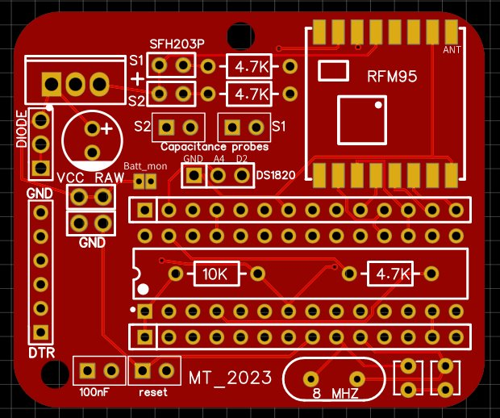{width="200"}

Adding the LoRa module is the most tricky part, therefore solder it as the first component onto the empty PCB, so that you will not be hindered by the presence of other components​.

Here a video showing how to solder the LoRa module onto the main PCB: [solder RFM95](https://github.com/FylloClip/tutorial/blob/main/resources/add_LoRa_module%20.mp4)

Now continue with the remaining components, it doesn't matter in which order, but it will be easier to add the 10K resistor before adding the socket for the Atmega328.

  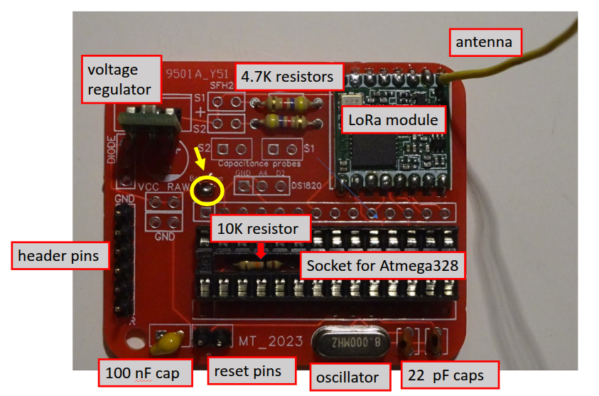{width="600"}

Now most of the components have been added... before inserting the Atmega328 chip into the socket, you need to burn the bootloader for the Pro Mini Arduino (8Mhz, 3.3V) onto it.​

If you want to monitor the battery voltage, solder a bridge between the two tiny solder plates marked with 'batt_mon' (yellow circle in the above pic), this will create a link between battery VCC and an analog pin of the microcontroller.

Instead of the male pin header (on the left) you can add a female header, depending on the type of FTDI adapter you will use for programming.​

The antenna (top right) is a piece of wire of 8.6 cm length.​

[**FylloClip sensor**]{.underline}

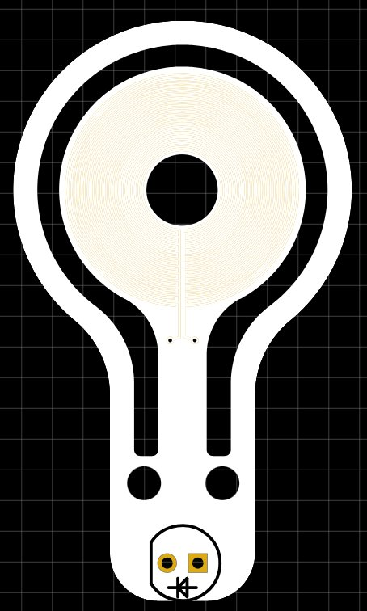{width="23%"} 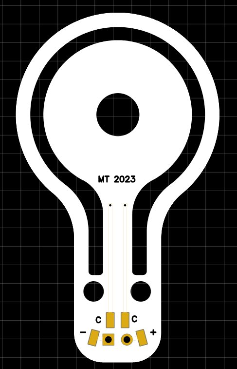{width="25%"}

Here you see the top and bottom side of a FylloClip sensor. The only component which needs to be added is the **SFH203P photodiode** acting as light sensor​.

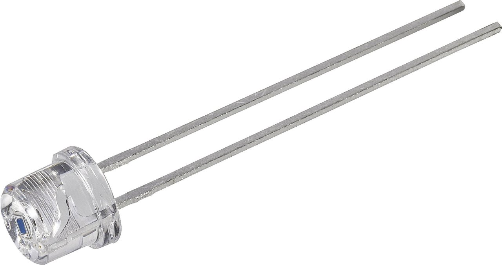{width="300"}

The photodiode has a polarity, so you need to pay attention to its correct placement. In order to place it correctly, make sure that the flat edge of the photodiode coincides with the outline of the photodiode printed on the sensor PCB.

On the bottom side of the sensor PCB you see four small solder pads, marked with 'c', 'c', '-' and '+'. The two pads marked 'c' are connected to the concentric electrodes on the central plate of the sensor and therefore dedicated to the measurement of the capacitance, whereas the pads marked '-'and '+' connect to the photodiode. Please note that the marking '+' does not stand for the cathode of the photodiode, but indicates that this pad needs to be connected to VCC on the microcontroller board. The correct position of the photodiode is indicated by the outline printed on the sensor, with the flat edge as the distinctive element. The wiring of the sensor to the microcontroller board is illustrated in the [figure below](../images/clipboard-%203797534038.png).

Onto these pads you have to solder the end of the cables, which will connect the sensor to the microcontroller board. Connect the cables so that they point towards the centre of the sensor plate (see images below), this will allow you later to attach the sensors to the leaf with the cables not protruding from the side of the leaf running straight under the leaf towards the petiole where they can be fixed to the leaf (see paragraph '[attaching the sensor to the leaf](https://fylloclip.github.io/tutorial/attaching_the_sensor.html)').

Try to use very thin and lightweight cables of about 1mm outer diameter. At the end put some nail polish on the soldered contacts, around the base of the photodiode and on both sides of the vias (tiny holes where copper traces pass from one side of the PCB to the other).

 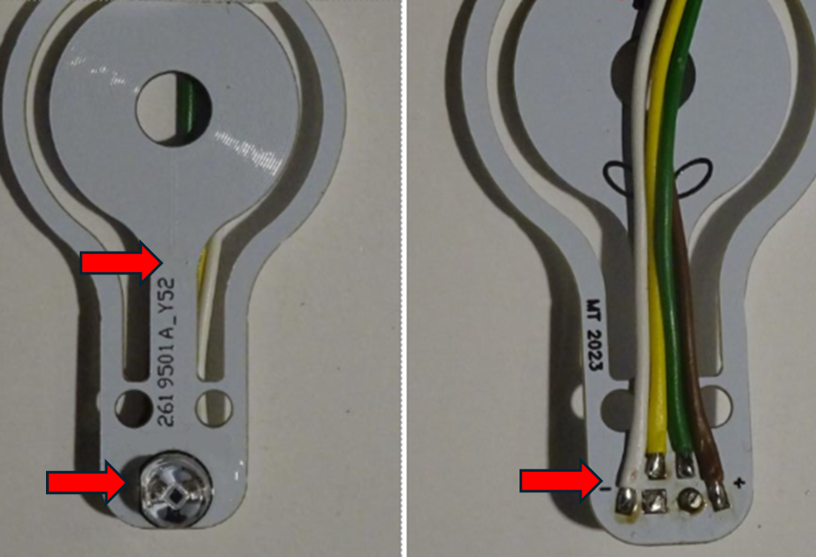{width="500"}

The red arrows indicate the places where to apply nail polish as a protective coating to prevent moisture from getting on the circuit.

Once you have soldered the cables to the foliar sensor and applied the polish, you can further fix the cables by adding a small cable tie passing through the two small holes on the sensor.

**Important note:** the new foliar sensors should be gently washed with soap or dish soap because it seems that some residue of the production process hinders the condensation of water vapour on their surface. Experience shows that after washing the sensitivity of the sensors greatly improves.

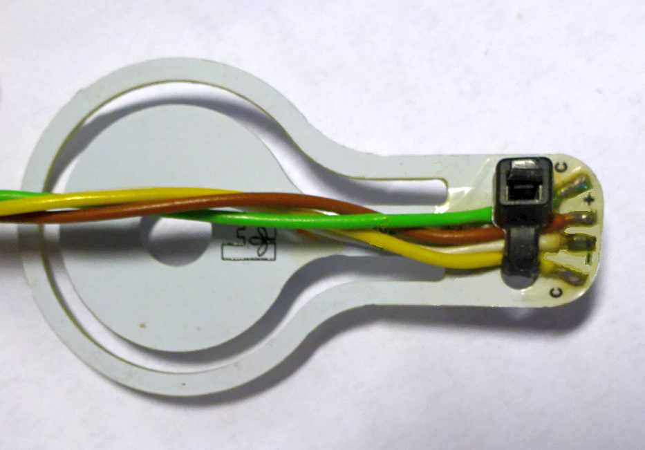{width="300"}

**Wiring of the sensors to the micrcontroller board:**

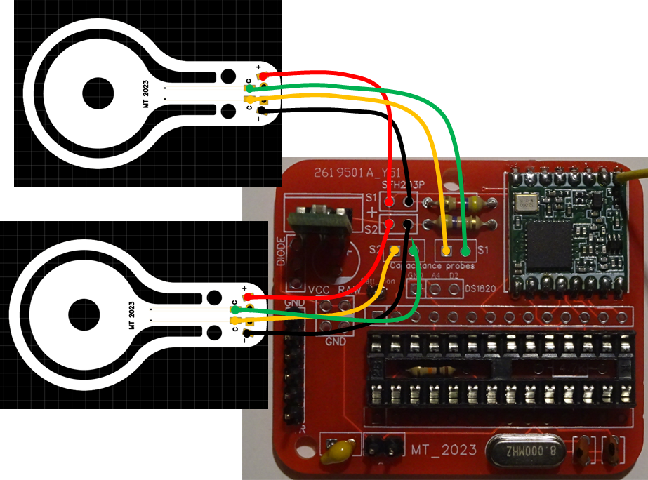{alt="wiring of the foliar sensors to the microcontroller board" width="600"}

**Wiring of the battery:**

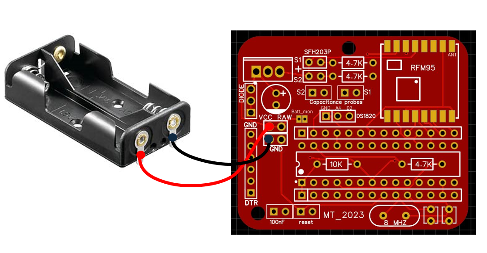{width="500"}

**The final result:**

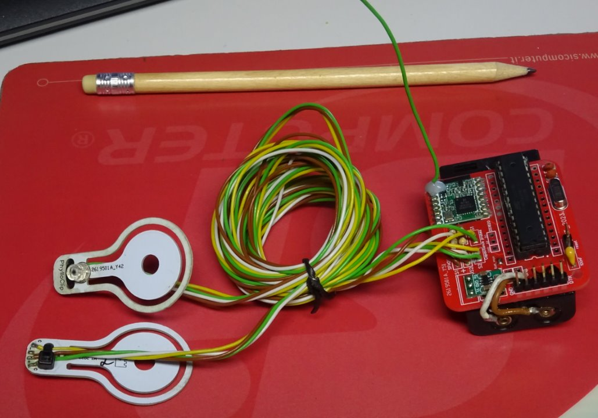{width="500"}

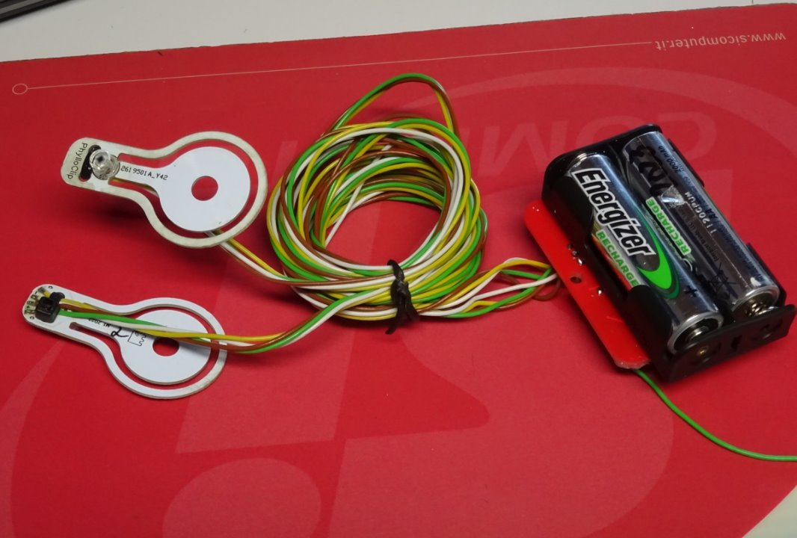{width="500"}
