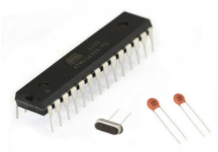
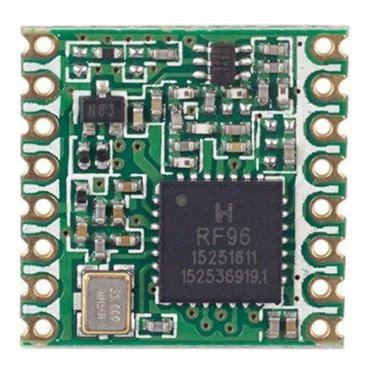
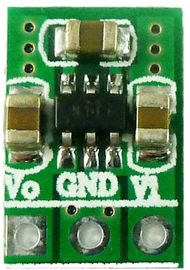
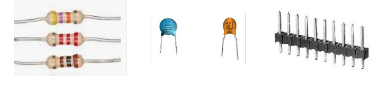
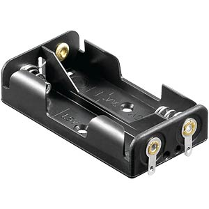

The circuit board is relatively simple and consists of a microcontroller chip, a LoRa radio module and a few additional components.

The main parts of the system:

 {width="150"}

ATmega328P-PU with 8 Mhz crystal and 2 capacitors (22pF). The ATmega328P chip needs to have the bootloader for the Arduino board version 'Pro or Pro Mini' with the processor selection 'ATmega328P (3.3V, 8 MHz)' burned onto it. More details about burning the bootloader [here](https://support.arduino.cc/hc/en-us/articles/4841602539164-Burn-the-bootloader-on-UNO-Mega-and-classic-Nano-using-another-Arduino).

{width="100"}

{width="75"}

{width="300"}

a few resistors, connectors, capacitors,...

{width="150"}

Battery holder for 2 AA batteries

Here a detailed list of all the required electronic components with links to a possible supplyer:

|  |  |
|------------------------------------|------------------------------------|
| **component**​ | **link**​ |
| photodiode​ | [https://www.reichelt.com](https://www.reichelt.com/it/en/shop/product/silicon_pin_photodiode_400_1100nm_150_5_mm-60569)​ |
| microcontroller atmega328 with bootloader for Arduino Pro Mini 3.3V​ | [https://www.reichelt.com](https://www.reichelt.com/it/en/shop/product/8-bit_atmega_avr_microcontroller_32_kb_20_mhz_pdip-28-119685) (you need to burn the bootloader onto the chip by yourself)​ |
| battery holder​ | [https://www.reichelt.com](https://www.reichelt.com/it/en/shop/product/battery_holder_2x_mignon_aa_-113169)​ |
| Crystal 8 Mhz​ | [https://www.reichelt.com](https://www.reichelt.com/it/en/shop/product/standard_quartz_fundamental_8_0_mhz-32845)​ |
| LoRa mosule RFM95w​ | [https://www.soselectronic.com](https://www.soselectronic.com/en-de/products/hoperf/rfm95w-868-s2r-1-180936)​ |
| Socket for microcontroller​ | [https://www.reichelt.com](https://www.reichelt.com/it/en/shop/product/ic_socket_28-pin_double_spring_contact-86281)​ |
| Male header pins ​ | [https://www.reichelt.com](https://www.reichelt.com/it/en/shop/product/pin_header_20-pin_gold_plated_separable-235649)​ |
| Female header pins​ | [https://www.reichelt.com](https://www.reichelt.com/it/en/shop/product/female_connector_2_54mm_1x20_separable_tin_plated-283794) (only in case you want to use female headers for the serial port)​ |
| Resistor 4.7K​ | [https://www.reichelt.com](https://www.reichelt.com/it/en/shop/product/carbon_film_resistor_1_4_w_5_4_7_kohm-1425)​ |
| Resistor 10K​ | [https://www.reichelt.com](https://www.reichelt.com/it/en/shop/product/carbon_film_resistor_1_4w_5_10_kilo-ohms-1338)​ |
| Capacitor 100nF​ | [https://www.reichelt.com](https://www.reichelt.com/it/en/shop/product/multilayer_capacitor_100_nf_50_100_v_z5u_20_rm_2_5-22977)​ |
| Capacitor 22pF​ | [https://www.reichelt.com](https://www.reichelt.com/it/en/shop/product/ceramic_capacitor_22_pf_10_npo_500_v_rm_5-9330)​ |
| connector cable | [https://www.reichelt.com](https://www.reichelt.com/it/en/shop/product/control_line_4_x_0_14_mm_unshielded_10_m_coil-10365) |
| Step-up voltage regulator​ | [https://www.aliexpress.com](https://www.aliexpress.com/item/1005005528299048.html)​ |
